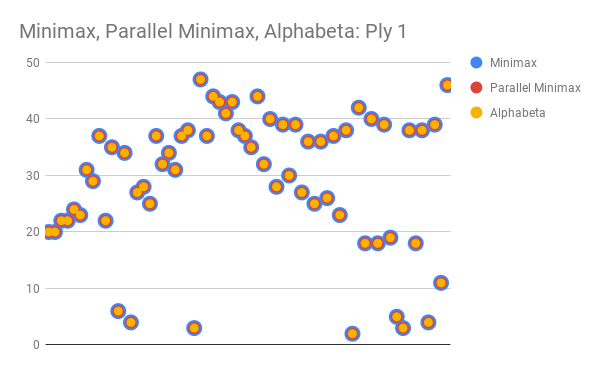
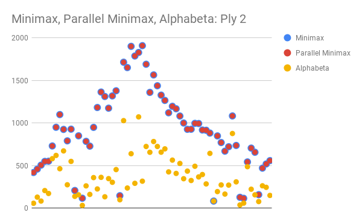
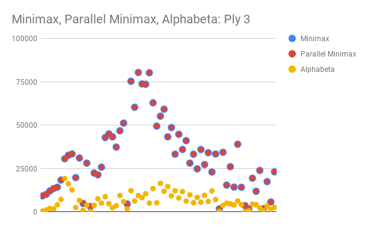
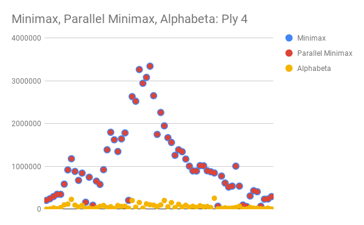
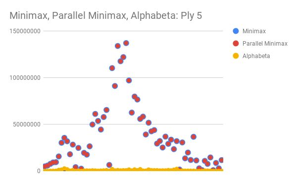
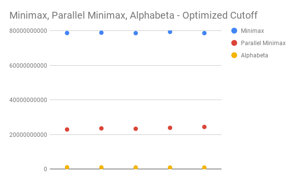

# Project 3 (Chess) Write-Up #
--------

## Project Enjoyment ##
- How Was Your Partnership?
  We were both busy during this project but still managed to communicate
  and work well together.
  
- What was your favorite part of the project?
  My favorite part was implementing the AlphaBeta and noticing how 
  much of a difference it made compared to the other algorithms.

- What was your least favorite part of the project?
  This project took us a little longer to debug than the other projects.

- How could the project be improved?
  Change the type of tests needed to do (maybe on a simplified chest board) 
  so the tests take less time, or maybe do something on parallized tests.

- Did you enjoy the project?
  Yes, we thought there was a good amount of interesting algorithms that 
  we implemented. It was cool to see how they are applied to games like 
  chess and tic tac toe.
    
-----

## Experiments ##

### Chess Game ###

#### Hypotheses ####
Suppose your bot goes 3-ply deep.  How many game tree nodes do you think
it explores (we're looking for an order of magnitude) if:
 - ...you're using minimax?
   If there are about 35 possible moves on average for any state in a game of chess and 
   minimax visits every node, then there should be about 35^3 nodes visited for 3-ply deep.
   This is on the order of about 10^4 nodes.
 - ...you're using alphabeta?
    Since alphaBeta does not necessarily need to explore every node in a branch, it will 
    explore significantly less nodes than minimax. When testing 4-ply, alphaBeta took about
    1/6 the time of minimax. If this correlates to the number of nodes explored, then alphaBeta
    probably would explore around 1/2 of the nodes that minimax explored. So alphaBeta would 
    explore around 18^3 nodes, which is on the magnitude of 10^4. 

#### Results ####
Run an experiment to determine the actual answers for the above.  To run
the experiment, do the following:
1. Run SimpleSearcher against AlphaBetaSearcher and capture the board
   states (fens) during the game.  To do this, you'll want to use code
   similar to the code in the testing folder.
2. Now that you have a list of fens, you can run each bot on each of them
   sequentially.  You'll want to slightly edit your algorithm to record the
   number of nodes you visit along the way.
3. Run the same experiment for 1, 2, 3, 4, and 5 ply. And with all three
   implementations (use ply/2 for the cut-off for the parallel
   implementation).  Make a pretty graph of your results (link to it from
   here) and fill in the table here as well:

 
 

|      Algorithm     | 1-ply    | 2-ply     | 3-ply      | 4-ply          | 5-ply |
| :----------------: |:-----:|:-----:|:-----:|:-----:|:-----:|
|       Minimax      |   29    |   933    |    31492  |    1061080  |   37224686  |
|  Parallel Minimax  |   29    |   933    |    31492  |    1061080  |   37224686  |
|      Alphabeta     |   29    |   372    |    6398   |    63343    |   721194    |

#### Conclusions ####
How close were your estimates to the actual values?  Did you find any
entry in the table surprising?  Based ONLY on this table, do you feel
like there is a substantial difference between the three algorithms?

Our conclusions were on similar magnitudes as our estimates. Parallel minimax
and minimax have the same number of nodes because they are the same algorithm,
just one uses parallelism. AlphaBeta is clearly much faster as it looks at less
nodes. I was surprised at how fast alphaBeta was at ply 4 and 5 due to how much
of the nodes it can avoid checking.  

### Optimizing Experiments ###
THE EXPERIMENTS IN THIS SECTION WILL TAKE A LONG TIME TO RUN. 

#### Generating A Sample Of Games ####
Because chess games are very different at the beginning, middle,
and end, you should choose the starting board, a board around the middle
of a game, and a board about 5 moves from the end of the game.  The exact boards
you choose don't matter (although, you shouldn't choose a board already in
checkmate), but they should be different.

#### Sequential Cut-Offs ####
Experimentally determine the best sequential cut-off for your
parallel mini-max searcher.  You should test this at depth 5.  
Plot your results and discuss which cut-offs work the best on each of
your three boards.

Starting at a cut-off of zero, the parallel minimax cuts down on time
exponentially to where it nears its asymptote around a cut-off between
3 and 4.  This is expected because at a cutoff of 0 the parallel minimax
is parallizing everything until it is down to one move.  As we increase 
the cut-off we get closer to the sweet spot around 3 - 4 where solving
the last 3 - 4 layers sequentially is faster than creating new
threads for each one. We start to the time increasing at 4 where increasing
the cut-off any more makes the parallelism less effective and the algorithm 
closer to the simple minimax. After a cut-off of 5, the increased cut-off
has no effect due to the depth of 5, if we thought about it more ahead of time
we would have realized there was no reason to test past a cut-off of 5.

.png)

#### Comparing The Algorithms ####
Now that you have found an optimal cut-off, 
you should compare the actual run times of your four implementations. 
At depth 5, using your optimal 
cut-offs, time all three of your algorithms
for each of the three boards.

Plot your results and discuss anything surprising about your results here.
For all 3 board states, early, mid, and end game, minimax was much slower than
the other two algorithms as expected. Alphabeta and Parallel Minimax were comparable
but Alphabeta was surprisingly always faster, although parallelization speed ups how
long it takes to check every nodes, the ammount of nodes that the Alphabeta algorithm 
doesn't have to look at counteracts that. We imagine if the Alphabeta was parallelized
if would be even faster.

|      Algorithm     | Early Game | Mid Game | End Game |
| :----------------: |:----------:|:--------:|:--------:|
|       Minimax      |     3278354721     |     78774123175    |      7749497496   |
|  Parallel Minimax  |     993802637      |     23650612556    |      2508425325   |
|      Alphabeta     |     124243360      |     1029432082     |      283095789    |

.png)
.png)

### Beating Traffic ###
In the last part of the project, you made a very small modification to your bot
to solve a new problem.  We'd like you to think a bit more about the 
formalization of the traffic problem as a graph in this question.  
- To use Minimax to solve this problem, we had to represent it as a game. In
  particular, the "states" of the game were "stretches of road" and the valid
  moves were choices of other adjacent "stretches of road".  The traffic and
  distance were factored in using the evaluation function.  If you wanted to use
  Dijkstra's Algorithm to solve this problem instead of Minimax, how would you
  formulate it as a graph?
  <pre>
 	The vertex where we start at for the Dijkstra's would be the starting point.
 	From were we can go from the starting point are all connecting vertices, we
 	would make the labels connecting these vertices the ammount of time it would
 	take to go from one vertex to another.  To prevent taking dead ends we would 
 	make sure we set deadends to represent the equivalent of negative infinity.
 	(such as we did in chess for check)
  </pre>

- These two algorithms DO NOT optimize for the same thing.  (If they did,
  Dijkstra's is always faster; so, there would be no reason to ever use
  Minimax.)  Describe the difference in what each of the algorithms is
  optimizing for.  When will they output different paths?
  <pre>
  	The Minimax solution would minimize the ammount of traffic while staying
  	under a certain ammount of time. But our Dijkstra's would pick the least 
  	ammount of time path, without considering traffic.  In a case where there
  	exists a longer path with less traffic under the time limit and a shorter 
  	path with more traffic, the two algorithms will output different paths.
  </pre>
  
 